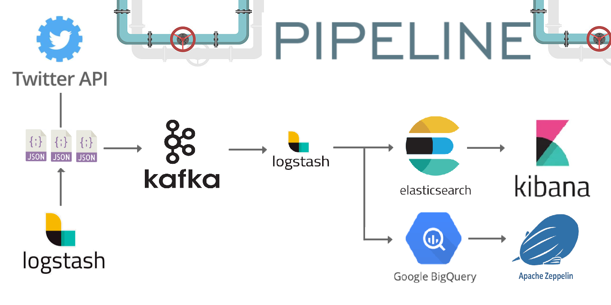
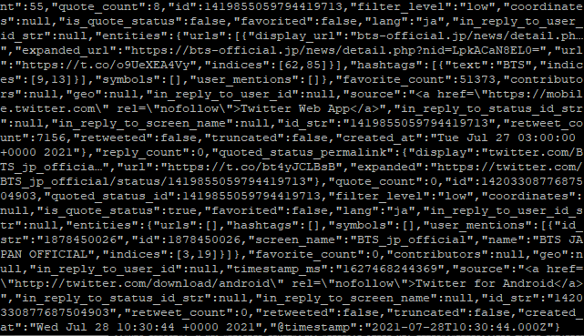

# Project for building Data Pipeline




---

> ### 데이터 생성
>
> twitter API 데이터 생성 -> logstash 통한 전송 환경 구성

1. Amazon EC2 instance 5대 구성 및  ssh key 발급

2. twitter open API access KEY 발급

3. VM server 1 접속

   ```sh
   $ chmod 400 ssh-key.pem
   $ ssh -i ssh-key.pem ubuntu@${server ip}
   $ sudo apt-get update
   ```

   * install JDK 1.8

   ```shell
   $ sudo apt-get install openjdk-8-jdk -y
   $ java -version
   ```

   * install logstash

   ```bash
   $ wget -qO - https://artifacts.elastic.co/GPG-KEY-elasticsearch | sudo apt-key add -
   $ sudo apt-get install apt-transport-https
   $ echo "deb https://artifacts.elastic.co/packages/7.x/apt stable main" | sudo tee -a /etc/apt/sources.list.d/elastic-7.x.list
   $ sudo apt-get update && sudo apt-get install logstash
   ```

   ```sh
   $ sudo vim /etc/logstash/jvm.options
   
   -Xms256m
   -Xmx256m
   
   # EC2 프리티어 버전의 경우 1G Memory 밖에 지원되지 않기 때문에 힙 메모리 사이즈 임의 조절
   ```

   * configure logstash

   ```sh
   $ sudo vim /etc/logstash/conf.d/logstash.conf
   ```

   ```sh
   input {
     twitter {
   	consumer_key => "API Key"
   	consumer_secret => "API Secret Key"
   	oauth_token => "Access Token"
   	oauth_token_secret => "Access Token Secret"
   	keywords => ["bts"]
   	full_tweet => true
     }
   }
   output {
     file {
   	path => "/tmp/twitter-%{+YYYY-MM-dd}.json"
   	codec => json_lines
     }
   }
   ```

   * logstash twitter input plugin : https://www.elastic.co/guide/en/logstash/current/plugins-inputs-twitter.html#plugins-inputs-twitter-consumer_key

     

   ```sh
   # 데이터 생성 확인
   $ sudo service logstash start
   ```

   ```sh
   # twitter log 실시간 수집 확인
   $ tail -f /tmp/twitter*.json
   
   $ less /tmp/twitter*.json
   
   '''vim 으로 확인하게 될 경우 데이터 크기가 크면 파일을 읽어들이는데 큰 overload가 생김'''
   ```

   

   ```sh
   # logstash 종료
   $ sudo service logstash stop
   ```

   ```bash
   # 잘 종료 되었는지 확인
   $ sudo jps
   ```

   > ## what is jps command?
   >
   > The `jps` command lists the instrumented Java HotSpot VMs on the target system. The command is limited to reporting information on JVMs for which it has the access permissions.

   

> ### 데이터 수집
>
> 데이터 buffering을 위한 kafka 구성

* VM server2 접속

  * java설치 및 kafka 설치

  ```bash
  $ wget https://mirror.navercorp.com/apache/kafka/2.8.0/kafka_2.12-2.8.0.tgz
  $ tar -xzf kafka_2.13-2.8.0.tgz
  ```

  * zookeeper 시작
  * `&` : background 실행 명령어

  ```bash
  $ ./bin/zookeeper-server-start.sh config/zookeeper.properties &
  ```

  * 실행 확인

  ```
  $ ps -ef|grep java
  ```

  [UNIX] ps 명령어 : https://github.com/JIKMAN/IT-study/blob/master/%5BUNIX%5D%20PS%20%EB%AA%85%EB%A0%B9%EC%96%B4.md

  * start kafka broker 

  ```bash
  $ ./bin/kafka-server-start.sh config/server.properties &
  ```

  * 힙 메모리 설정

  ```bash
  $ vim ./bin/kafka-server-start.sh
  export KAFKA_HEAP_OPTS="-Xmx256m -Xms256m"
  ```

  * zookeeper, kafka port 확인

  ```bash
  $ sudo netstat -anp | egrep "9092|2181"
  ```

  

* zookeeper : partition offset의 코드관리 및 kafka cluster의 health check를 담당

  * `zookeeper.properties`

  ```sh
  # snapshot 데이터를 저장할 경로를 지정
  dataDir=C:/dev/kafka_2.13-2.6.0/data/zookeeper
  # 클라이언트가 connect할 port 번호 지정
  clientPort=2181
  # 하나의 클라이언트에서 동시 접속하는 개수 제한, 기본값은 60이며, 0은 무제한
  maxClientCnxns=0
  # port 충돌을 방지하려면 admin server 비활성화(false)
  admin.enableServer=false
  # admin.serverPort=8080
  
  # 멀티 서버 설정을 위한 추가 코드
  # server.id=host:port:port
  server.1=localhost:2888:3888
  # server.2=server_host_1:2888:3888
  # server.3=server_host_2:2888:3888
   
  # 멀티 서버 설정시 각 서버의 dataDir 밑에 myid 파일이 있어야함.
  # echo 1 > myid
   
  # 리더 서버에 연결해서 동기화하는 시간, [멀티서버옵션]
  #initLimit=5
   
  # 리더 서버를 제외한 노드 서버가 리더와 동기화하는 시간, [멀티서버옵션]
  #syncLimit=2
  ```

  * kafka document : https://kafka.apache.org/documentation/#quickstart

* 카프카 topic 생성

```bash
$ ./bin/kafka-topics.sh --create --topic twitter --bootstrap-server \ localhost:9092 --replication-factor 1 --partitions 1
```

* 토픽 생성 확인

```bash
$ ./bin/kafka-topics.sh --list --bootstrap-server localhost:9092

$ ./bin/kafka-topics.sh --describe --bootstrap-server localhost:9092
```


* 토픽의 retention bytes 변경

```bash
$ ./bin/kafka-topics.sh --bootstrap-server localhost:9092 --entity-type topics --entity-name twitter --alter --add-config retention.bytes=100000000
```


> Cousumer, Producer test

```bash
# Test Producer
$ ./bin/kafka-console-producer.sh --broker-list localhost:9092 -topic twitter
# Test Consumer
$ ./bin/kafka-console-consumer.sh --bootstrap-server localhost:9092 -topic twitter
```


* logstash output 수정

```bash
output {
  kafka {
    topic_id => "twitter"
    bootstrap_servers => "server_IP:9092"
    acks => "1"
    codec => json_lines
  }
}

# servers에 s를 빼먹어서 몇시간을 고생했네요... 와아...
```


> ### 데이터 저장, 처리

* VM server ElasticSearch 01~03

* ElasticSearch install

```bash
# version 7.x
# ES 패키지 안에 java를 포함하고 있다.

wget https://artifacts.elastic.co/downloads/elasticsearch/elasticsearch-7.13.4-linux-x86_64.tar.gz
```

* JVM heap size 설정

```bash
$ vim config/jvm.options
-Xms512m
-Xmx512m
```

* tunning kernel parameter

```bash
$ sudo sysctl -w vm.max_map_count=262144 # default : 65530
$ sudo sysctl -p
$ sudo sysctl vm.max_map_count
```

* configuration

```bash
$ vim config/elasticsearch.yml

cluster.name: es-twitter-cluster # 클러스터 이름
node.name: node-1 # 노드 이름
network.host: 0.0.0.0 # 모든곳에서 통신 가능하도록 네트워크를 열어둠
```

* 실행 확인

```bash
$ ./bin/elasticsearch &
```

* 작동 check

```bash
$ curl -XGET localhost:9200
$ curl -XGET localhost:9200/_cluster/health?pretty
```

