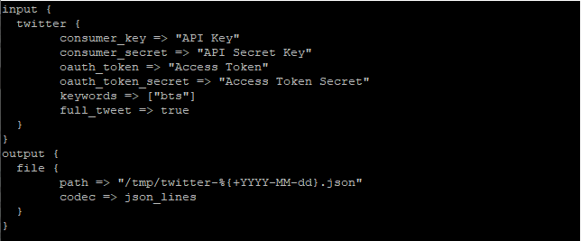
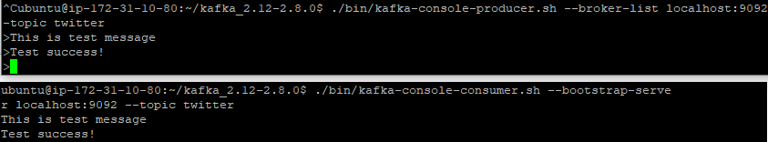
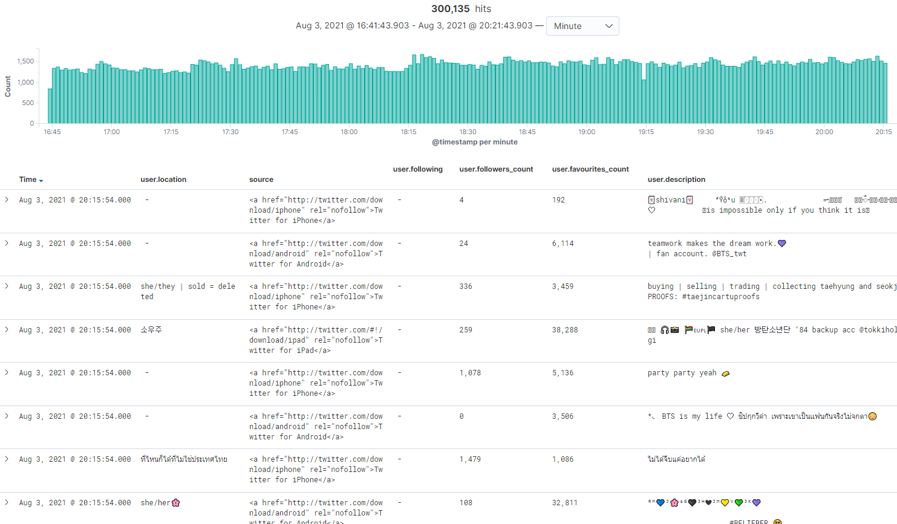
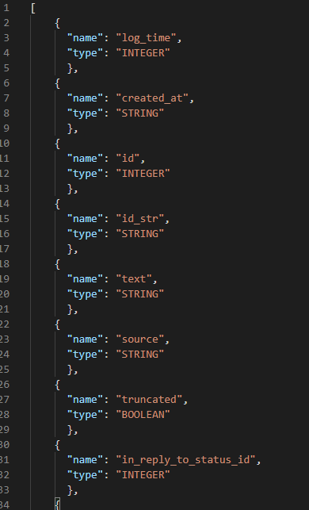

# Project for building Data Pipeline


---

> ### 데이터 생성
>
> twitter API 데이터 생성 -> logstash 통한 전송 환경 구성

1. Amazon EC2 instance 5대 구성 및  ssh key 발급


1. twitter open API access KEY 발급

2. VM server 1 접속

   ```sh
   $ chmod 400 ssh-key.pem
   $ ssh -i ssh-key.pem ubuntu@${server ip}
   $ sudo apt-get update
   ```

   * install JDK 1.8

   ```shell
   $ sudo apt-get install openjdk-8-jdk -y
   $ java -version
   ```

   * install logstash

   ```bash
   $ wget -qO - https://artifacts.elastic.co/GPG-KEY-elasticsearch | sudo apt-key add -
   $ sudo apt-get install apt-transport-https
   $ echo "deb https://artifacts.elastic.co/packages/7.x/apt stable main" | sudo tee -a /etc/apt/sources.list.d/elastic-7.x.list
   $ sudo apt-get update && sudo apt-get install logstash
   ```

   ```sh
   $ sudo vim /etc/logstash/jvm.options
   
   -Xms256m
   -Xmx256m
   
   # EC2 프리티어 버전의 경우 1G Memory 밖에 지원되지 않기 때문에 힙 메모리 사이즈 임의 조절
   ```

   * configure logstash:

   ```sh
   $ sudo vim /etc/logstash/conf.d/logstash.conf
   ```

   ```sh
   input {
     twitter {
   	consumer_key => "API Key"
   	consumer_secret => "API Secret Key"
   	oauth_token => "Access Token"
   	oauth_token_secret => "Access Token Secret"
   	keywords => ["bts"]
   	full_tweet => true
     }
   }
   output {
     file {
   	path => "/tmp/twitter-%{+YYYY-MM-dd}.json"
   	codec => json_lines
     }
   }
   ```

   * logstash twitter input plugin : https://www.elastic.co/guide/en/logstash/current/plugins-inputs-twitter.html#plugins-inputs-twitter-consumer_key

   kafka로 전송하기 전 input 데이터가 잘 생성되는지 확인하기 위해 현재 서버로 데이터를 전송받아 확인해봤다.

   

   ```sh
   # 데이터 생성 확인
   $ sudo service logstash start
   ```

   ```bash
   # twitter log 실시간 수집 확인
   '''vim 으로 확인하게 될 경우 데이터 크기가 크면 파일을 읽어들이는데 큰 overload가 생기기 때문에 다음 커맨드를 이용하여 확인'''
   
   $ tail -f /tmp/twitter*.json
   
   $ less /tmp/twitter*.json
   ```

   

   ```sh
   # logstash 종료
   $ sudo service logstash stop
   
   # 잘 종료 되었는지 확인
   $ sudo jps
   ```

   > ## what is jps command?
   >
   > The `jps` command lists the instrumented Java HotSpot VMs on the target system. The command is limited to reporting information on JVMs for which it has the access permissions.

   

> ### 데이터 수집
>
> 데이터 buffering을 위한 kafka 구성

* VM server2 접속

  * java설치 및 kafka 설치

  ```bash
  $ wget https://mirror.navercorp.com/apache/kafka/2.8.0/kafka_2.12-2.8.0.tgz
  $ tar -xzf kafka_2.13-2.8.0.tgz
  ```

  * zookeeper 시작
  * `&` : background 실행 명령어

  ```bash
  $ ./bin/zookeeper-server-start.sh config/zookeeper.properties &
  ```

  * 실행 확인

  ```
  $ ps -ef|grep java
  ```

  [UNIX] ps 명령어 : https://github.com/JIKMAN/IT-study/blob/master/%5BUNIX%5D%20PS%20%EB%AA%85%EB%A0%B9%EC%96%B4.md

  * start kafka broker 

  ```bash
  $ ./bin/kafka-server-start.sh config/server.properties &
  ```

  * 힙 메모리 설정

  ```bash
  # 전과 같은 이유로 힙메모리를 낮춰서 설정해준다.
  $ vim ./bin/kafka-server-start.sh
  export KAFKA_HEAP_OPTS="-Xmx256m -Xms256m"
  ```

  * zookeeper, kafka port 확인

  ```bash
  $ sudo netstat -anp | egrep "9092|2181"
  ```

  

* zookeeper : partition offset의 코드관리 및 kafka cluster의 health check를 담당

  * `zookeeper.properties`

    

  ```sh
  # snapshot 데이터를 저장할 경로를 지정
  dataDir=C:/dev/kafka_2.13-2.6.0/data/zookeeper
  # 클라이언트가 connect할 port 번호 지정
  clientPort=2181
  # 하나의 클라이언트에서 동시 접속하는 개수 제한, 기본값은 60이며, 0은 무제한
  maxClientCnxns=0
  # port 충돌을 방지하려면 admin server 비활성화(false)
  admin.enableServer=false
  # admin.serverPort=8080
  
  # 멀티 서버 설정을 위한 추가 코드
  # server.id=host:port:port
  server.1=localhost:2888:3888
  # server.2=server_host_1:2888:3888
  # server.3=server_host_2:2888:3888
   
  # 멀티 서버 설정시 각 서버의 dataDir 밑에 myid 파일이 있어야함.
  # echo 1 > myid
   
  # 리더 서버에 연결해서 동기화하는 시간, [멀티서버옵션]
  #initLimit=5
   
  # 리더 서버를 제외한 노드 서버가 리더와 동기화하는 시간, [멀티서버옵션]
  #syncLimit=2
  
  '''해당 프로젝트는 리소스 제한으로 단일 서버로 진행한다.'''
  ```

  * kafka document : https://kafka.apache.org/documentation/#quickstart

* 카프카 topic 생성

```bash
$ ./bin/kafka-topics.sh --create --topic twitter --bootstrap-server \ localhost:9092 --replication-factor 1 --partitions 1
```

* 토픽 생성 확인

```bash
$ ./bin/kafka-topics.sh --list --bootstrap-server localhost:9092

$ ./bin/kafka-topics.sh --describe --bootstrap-server localhost:9092
```

* 토픽의 retention bytes 변경

  log 파일의 최소 용량을 의미한다. (default: -1;제한없음)

```bash
$ ./bin/kafka-topics.sh --bootstrap-server localhost:9092 --entity-type topics --entity-name twitter --alter --add-config retention.bytes=100000000
```


> Cousumer, Producer test

```bash
# Test Producer
$ ./bin/kafka-console-producer.sh --broker-list localhost:9092 -topic twitter
# Test Consumer
$ ./bin/kafka-console-consumer.sh --bootstrap-server localhost:9092 -topic twitter
```




* logstash output 수정

```bash
output {
  kafka {
    topic_id => "twitter"
    bootstrap_servers => "server_IP:9092"
    acks => "1"
    codec => json_lines
  }
}
```


> ### 데이터 저장, 처리

* VM server ElasticSearch 01~03

* ElasticSearch install

```bash
# version 7.x
# ES 패키지 안에 java를 포함하고 있다.

wget https://artifacts.elastic.co/downloads/elasticsearch/elasticsearch-7.13.4-linux-x86_64.tar.gz
```

* JVM heap size 설정

```bash
$ vim config/jvm.options
-Xms512m
-Xmx512m
```

* tunning kernel parameter

  엘라스틱서치 실행 시 다음과 같은 에러 메시지가 발생했다.

```bash
bootstrap checks failed max virtual memory areas vm.max_map_count [65530] is too low, increase to at least [262144]
```

AWS EC2 프리티어로 구성한 운영체제에 기본으로 설정되어 있는 mmap이 너무 적게 설정되어 생기는 오류인데, 엘라스틱서치는 262144 이상을 할당받도록 로직되어있다.

```bash
$ sudo sysctl -w vm.max_map_count=262144 # default : 65530
$ sudo sysctl -p # 변경사항 적용
$ sudo sysctl vm.max_map_count
vm.max_map_count = 262144 # 변경 확인
```

* configuration

```bash
$ vim config/elasticsearch.yml

cluster.name: es-twitter-cluster # 클러스터 이름
node.name: node-1 # 노드 이름
network.host: 0.0.0.0 # 모든곳에서 통신 가능하도록 네트워크를 열어둠
Discovery.type: single-node # 단일 노드 환경으로 설정
```

* 실행 확인

```bash
$ ./bin/elasticsearch &
```

* 작동 check

```bash
$ curl localhost:9200
$ curl localhost:9200/_cluster/health?pretty
$ curl -X GET "localhost:9200/_cat/nodes?v=true&pretty"
```

* setting API

데이터를 집어넣는 과정에서 다음과 같은 error가 발생하였다.

```
Limit of total fields [1000] in index twitter-20210803 has been exceeded.
```

찾아본 결과, elastic search에서 기본 설정된 fields의 수는 1000개 이지만 트위터 API를 통해 생성되는 데이터의 경우 트윗의 리트윗의 리트윗... 하여 정말 복잡하게 1000개 이상의 field가 생성되기 때문이라고 한다. 따라서 index에 맞게 변경해주어야 한다. 

또한, 해당 프로젝트에서는 elastic search를 단일 노드로 구성하므로 replicas 개수를 0개로 지정해준다.

```bash
# 인덱스 구조에 맞게 설정을 setting

curl -XPUT 'localhost:9200/twitter-20210803/_setting' -d'
{
"index.mapping.totla_fields.limit" : 3000
"number_of_replicas" : 0
  }
}'
```

* #### kafka consumer 설정

  * 새로운 VM에 logstash server configuration setting

```bash
$ sudo vim /etc/logstash/conf.d/logstash.conf
```


```bash
# input : kafka -> output : elasticsearch

input {
  kafka {
    bootstrap_servers => "{server ip}:9092"
    codec => json_lines
    consumer_threads => 1
    group_id => "twitter_log_to_es"
	topics => "twitter"
  }
}
output {
  elasticsearch {
    codec => json
    hosts => "{server ip}:9200"
    index => "twitter-%{+YYYYMMdd}"
    workers => 1
  }
}
```

```bash
$ sudo service logstash start
```


> ### 데이터 조회

```html
http://{kibana_server_ip}:5601
```

* **index** : **twitter**-*




> ### 데이터 저장, 처리

#### Big Query

* schema 정의

카프카 -> 빅쿼리로 데이터를 적재하기 위해서 빅쿼리 테이블의 스키마를 직접 정의해 주어야 한다. 하지만 1000개가 넘는 트위터 필드를 직접 정의할 수는 없었기에, 열심히 깃허브, 구글링을 찾아가며 트위터 구조에 맞게 정의되어 있는 소스코드를 찾아보았지만, 계속 변화하는 트위터답게 구조가 많이 바뀌어서 적용되지 않았다. 따라서 빅쿼리에 데이터를 적재하고 제플린으로 조회하는 과정은 따로 진행하지 않고, 과정만 정리했다.



```bash
$ bq mk twitterdataset
```

```bash
$ bq mk twitterdataset.twitter-20210803 ./bigquery.json
# twitterdataset에 twitter-20210803 table 생성, table에 미리 정의한 bigquery.json schema적용
```

* GCS bucket 생성

```bash
$ gsutil mb -c nearline -l asia gs://twitter-test-bucket
```

* 데이터 처리를 위한 logstash install 및 config

```bash
$ sudo vim /etc/logstash/conf.d/logstash.conf
```

```bash
input {
  kafka {
	bootstrap_servers => "${server ip}:9092"
	codec => json_lines
	consumer_threads => 1
	group_id => "twitter_log_to_gcs"
	topics => "twitter"
  }
}
output {
  google_cloud_storage {
	bucket => "${gs bucket name}"
	key_path => "/path/to/key"
	service_account => "${api service account}"
	codec => json_lines
	gzip => true
	max_file_size_kbytes => 100000
	key_password => "${key password}"
	output_format => json
  }
}
```


* load data to bigquery

```bash
$ bq --nosync load --autodetect --ignore_unknown_values --max_bad_records=1000 --source_format="NEWLINE_DELIMITED_JSON" twitterdataset.twitter-20210803 gs://twitter-test-bucket/*.gz "/home/ubuntu/bigquery.json"

# --ignore_unkown_values : 정의하지 않은 필드는 무시
# --max_bad_records : error를 몇개까지 허용할 것인지 (default : 1000)
# source_format : 읽어오는 type
```

* check job status

````bash
$ bq ls -j
````

* debuging error

```bash
$ bq show -j ${job id}
```

> ### 데이터 조회

#### Zeppelin

- zeppelin install
- configure bigquery credential

```
$ cp zeppelin/conf/zeppelin-env.sh.template zeppelin-env.sh
$ vim zeppelin/conf/zeppelin-env.sh
export GOOGLE_APPLICATION_CREDENTIALS="/path/to/bigquery-privatekey.json"
```

- start zeppelin

```
$ cd zeppelin
$ ./bin/zeppelin-daemon.sh start
```

- connect to `https:{server-ip}:8080`
- configure bigquery interpreter in Zeppelin
