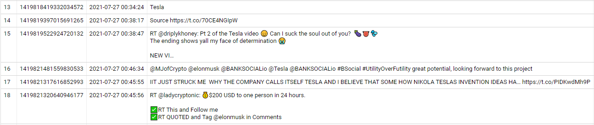
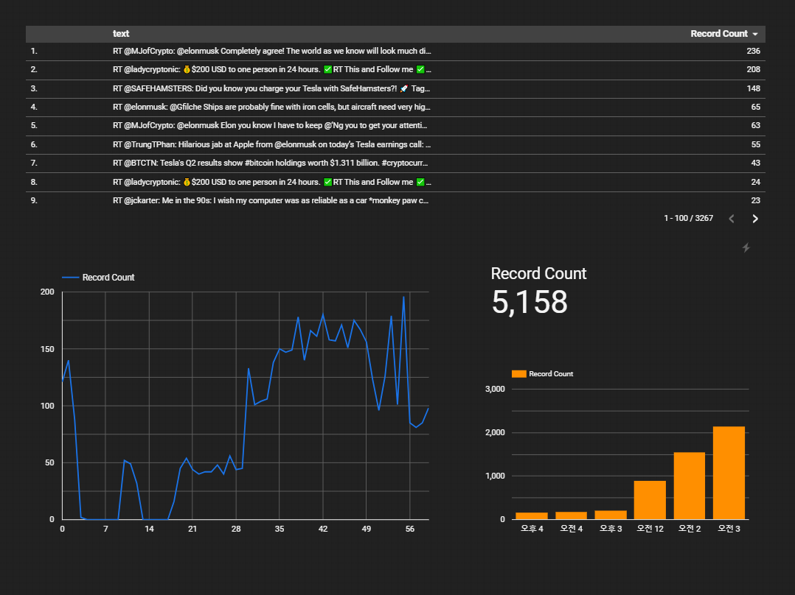
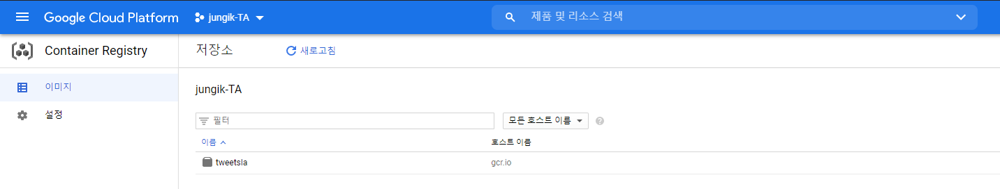

# Data pipeline based GCP

#### Twitter Open API를 이용한 GCP기반 Data Pipeline 구축 프로젝트


### 1. Twitter API 발급

* Twitter Developer Platform 공식 문서 : https://developer.twitter.com/en/docs/twitter-api

* GCP IAM 서비스 계정 생성

  * 계정 권한 추가 : pub/sub 편집자 / Big-query 데이터 편집자
  * 비공개 키 발급 ( json 형태 )

  

### 2. Twitter Streaming Code 작성

```python
import tweepy

twitter_api_key = '<twitter_api_key>'
twitter_api_secret_key = '<twitter_api_secret_key>'
twitter_access_token = '<twitter_access_token>'
twitter_access_token_secret = '<twitter_access_token_secret>'

class SimpleStreamListener(tweepy.StreamListener):
	def on_status(self, status):
		print(status)
        
stream_listener = SimpleStreamListener()

auth = tweepy.OAuthHandler(twitter_api_key, twitter_api_secret_key)
auth.set_access_token(twitter_access_token, twitter_access_token_secret)

twitterStream = tweepy.Stream(auth, stream_listener)
twitterStream.filter(track=['tesla']) # tesla 내용이 들어간 트윗을 스트림
```


### 3. Google Cloud Pub/Sub

* 완전 관리형 실시간 메시징 서비스

1. Topic 생성

2. Subscription(구독) 추가

   ```bash
   # Subscription name 예시
   projects/My_project/subscriptions/My_Sub
   
   # Delivary Type
   Pull 설정
   ```

3.  Pub/Sub으로 메시지 전송

   * Streaming Code 추가

```python
import json
import tweepy
from google.cloud import pubsub_v1
from google.oauth2 import service_account

key_path = "Personal_GCP_IAM_key"

credentials = service_account.Credentials.from_service_account_file(
key_path,
scopes=["https://www.googleapis.com/auth/cloud-platform"])

client = pubsub_v1.PublisherClient(credentials=credentials)
topic_path = client.topic_path('Project_name', 'Topic_name')

twitter_api_key = '<twitter_api_key>'
twitter_api_secret_key = '<twitter_api_secret_key>'
twitter_access_token = '<twitter_access_token>'
twitter_access_token_secret = '<twitter_access_token_secret>'


class SimpleStreamListener(tweepy.StreamListener):
	def on_status(self, status):
		print(status)
        # 트위터 로그 구조에 맞게 필드를 지정
		tweet = json.dumps({'id': status.id, 'created_at': status.created_at, 'text': status.text}, default=str)
		client.publish(topic_path, data=tweet.encode('utf-8'))
def on_error(self, status_code):
	print(status_code)
	if status_code == 420:
		return False
    
stream_listener = SimpleStreamListener()

auth = tweepy.OAuthHandler(twitter_api_key, twitter_api_secret_key)
auth.set_access_token(twitter_access_token, twitter_access_token_secret)

twitterStream = tweepy.Stream(auth, stream_listener)
twitterStream.filter(track=['data'])
```


* 공식문서 : https://cloud.google.com/pubsub/docs/overview

  
  

### 4. BigQuery

* 완전 관리형 SQL 데이터 웨어하우스

1. 데이터 세트(DB) 생성

2. 테이블 생성

   

### 5. Google Cloud Functions

*  클라우드 서비스를 빌드 및 연결하기 위한 서버리스 실행 환경
* 트리거 조건과 코드를 설정해놓으면, 원하는 동작을 자동으로 수행
* 공식문서 : https://cloud.google.com/functions/docs/concepts/overview?hl=ko


1. Cloud function 생성

* __cloud function 소스코드__

```python
import base64		
import json		
from google.cloud import bigquery		
		
def tweets_to_bq(tweet):		
    client = bigquery.Client()		
    dataset_ref = client.dataset('tweet_data')		
    table_ref = dataset_ref.table('tweets')		
    table = client.get_table(table_ref)		
	
    tweet_dict = json.loads(tweet)		
    rows_to_insert = [	
        (tweet_dict['id'], tweet_dict['created_at'], tweet_dict['text'])
    ]	
	
    error = client.insert_rows(table, rows_to_insert)		
    print(error)		
		
def hello_pubsub(event, context):		
    """Triggered from a message on a Cloud Pub/Sub topic.		
    Args:		
         event (dict): Event payload.		
         context (google.cloud.functions.Context): Metadata for the event.		
    """		
    pubsub_message = base64.b64decode(event['data']).decode('utf-8')	
    print(pubsub_message)		
```

* __requirement.txt__

```python
# Function dependencies, for example:
# package>=version
google-cloud-bigquery
```


### 6. BigQuery 쿼리 실행

```sql
SELECT * FROM 'jungik-ta.tweet_data.tweets'
```

오류 없이 데이터 조회 가능




### 7. Data Studio

간단하게 실시간 로그 대시보드로 구현




### 8. Google Kubernetes Engine

1. Dockerfile 생성

```dockerfile
# Use an official Python runtime as a parent image
FROM python:3.9.4

# Set the working directory to /app
WORKDIR /app

# Copy the current directory contents into the contatiner at /app
ADD . /app

# Install any needed packages specified in requirements.txt
RUN pip install --trusted-host pypi.python.org -r requirements.txt

# Define environment variable
ENV GOOGLE_APPLICATION_CREDENTIALS="/app/jungik-ta-aa9fa3a5da97.json"

# Run app.py when the container launches
CMD ["python", "tweet.py"]
```

2. 컨테이너 빌드

* `docker build -t tweetsla`
* `docker tag tweetsla gcr.io/jungik-ta/tweetsla`

3. Google Container Registry 연동
4. 이미지 배포

* push gcr.io/jungik-ta/tweetsla



